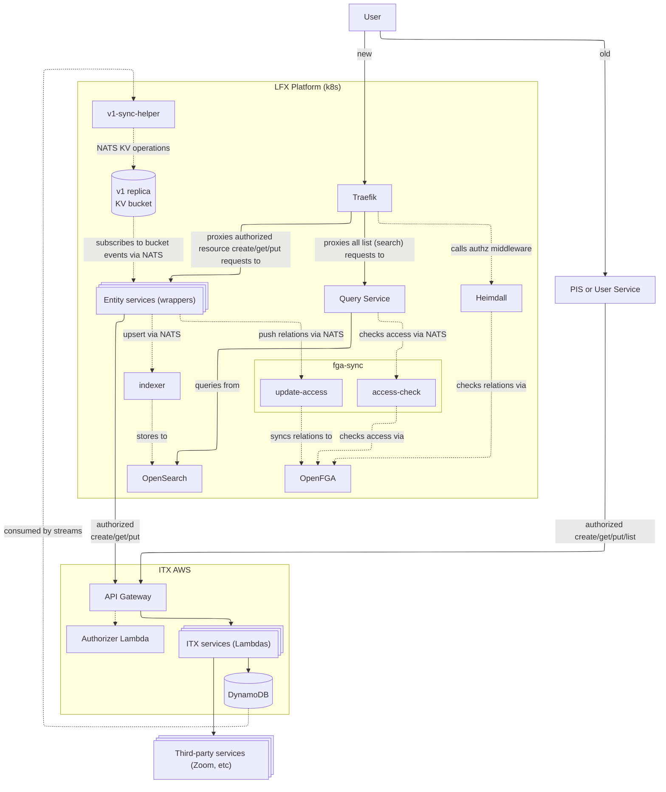
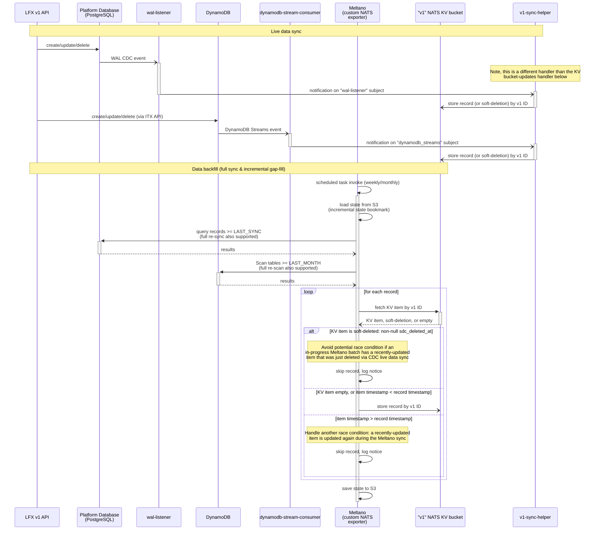
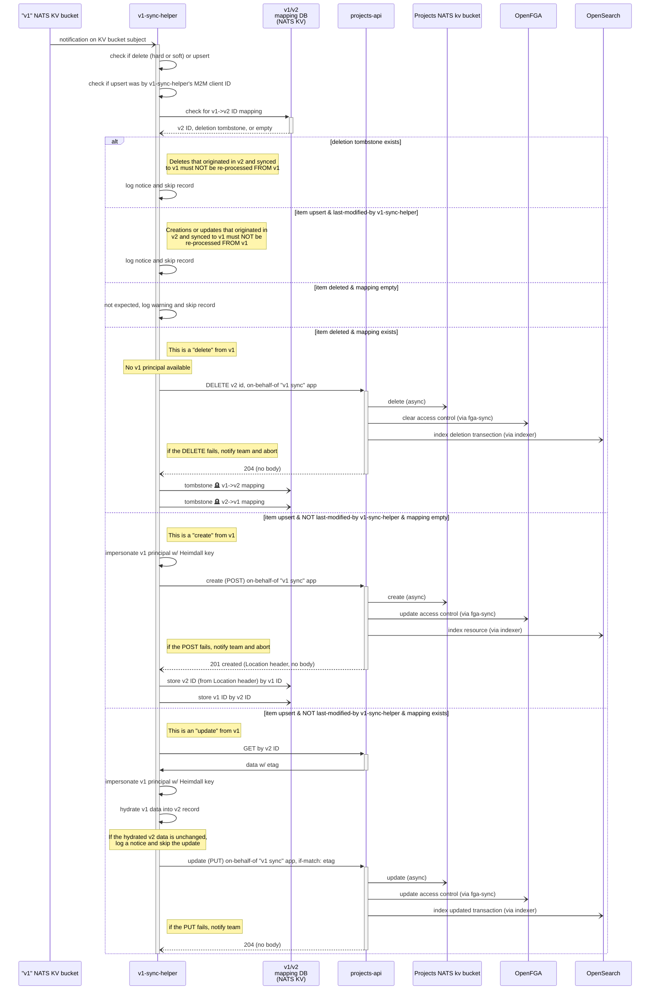
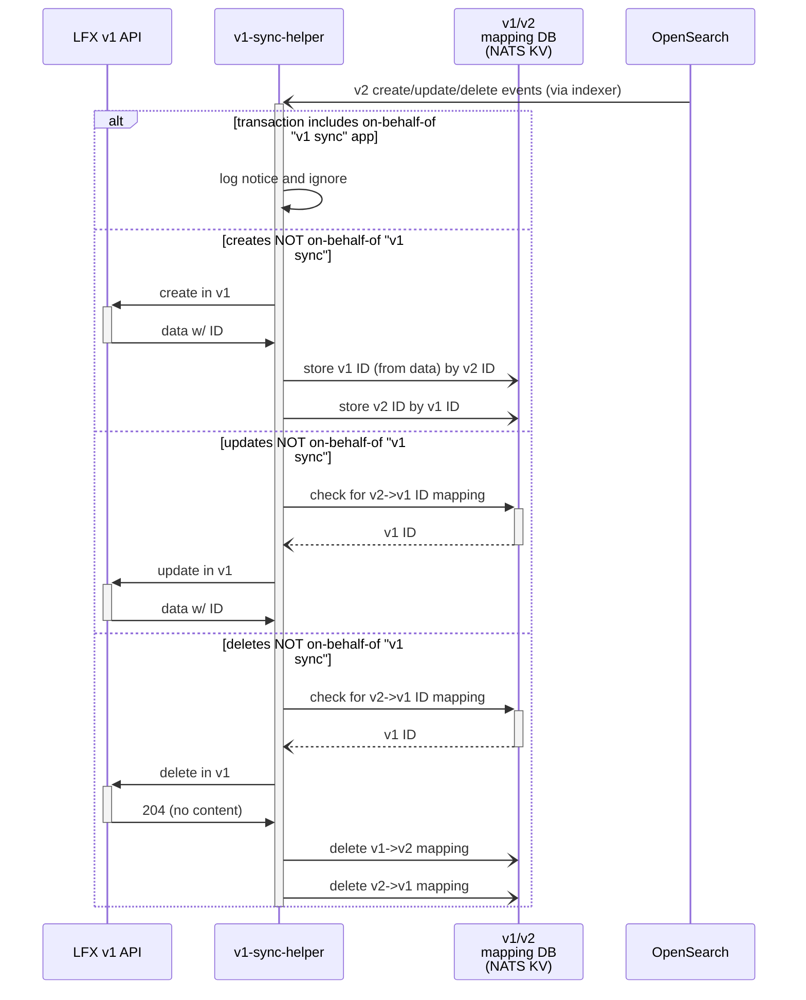

# Data sync components for LFX One

This repository contains tools and services for synchronizing data between LFX v1 and LFX One (v2) platforms. This solution uses Meltano for data extraction and loading, a WAL listener for real-time PostgreSQL change streaming, and a sync helper service that handles data mapping and ingestion into the v2 ecosystem.

## Overview

This repository serves two distinct purposes:

1. **Real-time streaming replication.** PostgreSQL WAL events (via `wal-listener`) and DynamoDB Streams are replicated in real time—alongside periodic Meltano backfills—into a `v1-objects` NATS KV bucket. LFX One wrapper services subscribe to this bucket to drive indexing pipelines (OpenSearch via the indexer service) and access-control pipelines (OpenFGA via fga-sync), without needing to integrate directly with ITX eventing.

2. **Bidirectional sync for "core" resources.** Projects and committees are fully synced in both directions between LFX v1 and LFX One. This gives LFX One a self-contained stack for these entity types, which simplifies developer environment stand-up by removing the dependency on the highly-interconnected LFX/Salesforce/ITX stack.

ITX-hosted resources such as Meetings are handled by v2 "wrapper" services that sit in front of the ITX APIs and rely on the NATS KV replication above for eventing; they do **not** get their own native v2 entity storage. See the [ITX wrappers component diagram](#itx-wrappers-component-diagram) in the Architecture Diagrams section for how this fits together.

## Prerequisites

- Python 3.12 (managed automatically by uv)
- `uv` package manager installed
- Access to LFX v1 data sources (DynamoDB, PostgreSQL)
- LFX One platform running [via Helm](https://github.com/linuxfoundation/lfx-v2-helm/tree/main/charts/lfx-platform#readme)

Please see each component for further setup instructions.

## Repository structure

This repository contains three main components:

### [Meltano](./meltano/README.md)

Data extraction and loading pipeline that extracts data from LFX v1 sources (DynamoDB for meetings, PostgreSQL for projects/committees) and loads it into NATS KV stores for processing by the v2 platform.

### [v1-sync-helper](./cmd/lfx-v1-sync-helper/README.md)

Go service that monitors NATS KV stores for replicated v1 data and synchronizes it with the LFX v2 platform APIs, handling data transformation and conflict resolution.

### [Helm charts](./charts/lfx-v1-sync-helper/README.md)

Kubernetes deployment manifests for the custom app service and WAL listener component, providing scalable deployment options for production environments.

## Research & guides

- [Adding a new DynamoDB table](./research/adding-dynamodb-table.md) — step-by-step checklist for onboarding a new DynamoDB table into the Meltano pipeline and stream consumer, with a worked example.
- [Updating the Meltano catalog ConfigMap](./research/updating-meltano-catalog.md) — how to regenerate and apply the schema cache when tables or columns change.

## NATS API

The v1-sync-helper service provides a NATS request/reply function for querying v1-v2 ID mappings.

### Request/Reply Subject

| Subject                 | Description                                 |
|-------------------------|---------------------------------------------|
| `lfx.lookup_v1_mapping` | Bidirectional v1↔v2 mapping lookup function |

### Usage

Send a NATS request to `lfx.lookup_v1_mapping` with the mapping key as the payload. The service will respond with the corresponding mapping value or an error.

**Request Format:**

```
Subject: lfx.lookup_v1_mapping
Payload: <mapping_key>
```

**Response Format:**

- **Success**: The mapped value as a string
- **Not Found**: Empty string (`""`)
- **Error**: String prefixed with `"error: "` (e.g., `"error: connection timeout"`)

### Available Lookup Patterns

**Note**: While called "sfid", v1 committees and committee members actually store UUIDs in their "sfid" column, so references to `{*_sfid}` for these entities will contain UUIDs.

The following table shows the supported mapping key patterns and their expected response formats:

| Direction | Lookup Key Pattern | Example Key | Response Format | Description |
|-----------|-------------------|-------------|-----------------|-------------|
| **Projects** |
| v1→v2 | `project.sfid.{v1_sfid}` | `project.sfid.a0941000002wBjEAAU` | `{v2_uuid}` | Project SFID to UUID |
| v2→v1 | `project.uid.{v2_uuid}` | `project.uid.123e4567-e89b-12d3-a456-426614174000` | `{v1_sfid}` | Project UUID to SFID |
| **Committees** |
| v1→v2 | `committee.sfid.{v1_sfid}` | `committee.sfid.123e4567-e89b-12d3-a456-426614174003` | `{v2_uuid}` | Committee SFID to UUID |
| v2→v1 | `committee.uid.{v2_uuid}` | `committee.uid.123e4567-e89b-12d3-a456-426614174001` | `{project_sfid}:{committee_sfid}` | Committee UUID to compound SFID |
| **Committee Members** |
| v1→v2 | `committee_member.sfid.{v1_sfid}` | `committee_member.sfid.123e4567-e89b-12d3-a456-426614174004` | `{committee_uuid}:{member_uuid}` | Member SFID to compound UUID |
| v2→v1 | `committee_member.uid.{v2_member_uuid}` | `committee_member.uid.123e4567-e89b-12d3-a456-426614174002` | `{project_sfid}:{committee_sfid}:{member_sfid}` | Member UUID to compound SFID |

### User SFID Lookup API

The service also provides NATS request/reply functions for resolving v1 platform user SFIDs by username or email. These lookups use validated secondary indexes to handle stale data gracefully.

| Subject | Description |
|---------|-------------|
| `lfx.lookup_v1_user_sfid.by_username` | Lookup v1 user SFID by username |
| `lfx.lookup_v1_user_sfid.by_email` | Lookup v1 user SFID by email |

**Request Format:**

```
Subject: lfx.lookup_v1_user_sfid.by_username
Payload: <username>

Subject: lfx.lookup_v1_user_sfid.by_email
Payload: <email>
```

**Response Format:**

- **Success**: The v1 user SFID as a string
- **Not Found**: Empty string (`""`) — includes stale index detection
- **Error**: String prefixed with `"error: "` (e.g., `"error: connection timeout"`)

**Notes:**

- These lookups perform validation against the actual user record to handle stale index data
- If a username/email no longer exists on the resolved user, the lookup returns an empty string (miss)
- The underlying secondary indexes (`v1-user.username.*`, `v1-user.email.*`) should not be queried directly via `lfx.lookup_v1_mapping`

## Architecture Diagrams

Regarding the following sequence diagrams:

- "Projects API" is representative of the core resources that have bidirectional sync (projects, committees). ITX-hosted resources such as Meetings are handled by wrapper services that subscribe to the NATS KV bucket instead—see the component diagram below.

### ITX wrappers component diagram

This diagram shows how the LFX One platform, the v1-sync-helper replication pipeline, and ITX-hosted services fit together at the component level.



### Data extraction/replication sequence diagram



### LFX One data-loading sequence diagram



### LFX One to v1 bidirectional sync

Implemented for **committees** and **committee members**. The v1-sync-helper subscribes to indexer domain events (`lfx.committee.*`, `lfx.committee_member.*`) published after every successful OpenSearch write and mirrors the change to the v1 API via the Project Service v2 API.

Loop detection: if a non-tombstoned reverse mapping already exists for the v2 object, the event originated from v1 and is skipped to prevent infinite sync loops.



### Combined sequence diagram

Several of the sequence diagram participants are shared in the previous diagrams. This next diagram combines the previous diagrams to help show how the data sync works holistically (in its expected, final target state).

```mermaid
sequenceDiagram
    participant lfx_v1 as LFX v1 API
    participant postgres as Platform Database<br/>(PostgreSQL)
    participant wal-listener
    participant dynamodb as DynamoDB
    participant dynamo-stream as dynamodb-stream-consumer
    participant meltano as Meltano<br/>(custom NATS<br/>exporter)
    participant v1_kv as "v1" NATS KV bucket
    participant v1-sync-helper
    participant mapping-db as v1/v2<br/>mapping DB<br/>(NATS KV)
    participant projects-api
    participant projects-kv as Projects NATS kv bucket
    participant openfga as OpenFGA
    participant opensearch as OpenSearch

    Note over lfx_v1,v1-sync-helper: Live data sync
    lfx_v1 ->> postgres: create/update/delete
    postgres-)+wal-listener: WAL CDC event
    Note over v1-sync-helper: Note, this is a different handler than the KV<br />bucket-updates handler below
    wal-listener-)+v1-sync-helper: notification on "wal-listener" subject
    deactivate wal-listener
    v1-sync-helper-)-v1_kv: store record (or soft-deletion) by v1 ID
    lfx_v1 ->> dynamodb: create/update/delete (via ITX API)
    dynamodb-)+dynamo-stream: DynamoDB Streams event
    dynamo-stream-)+v1-sync-helper: notification on "dynamodb_streams" subject
    deactivate dynamo-stream
    v1-sync-helper-)-v1_kv: store record (or soft-deletion) by v1 ID

    Note over lfx_v1,v1_kv: Data backfill (full sync & incremental gap-fill)
    meltano->>meltano: scheduled task invoke (weekly/monthly)
    activate meltano
    meltano->>meltano: load state from S3<br/>(incremental state bookmark)
    meltano->>+postgres: query records >= LAST_SYNC<br/>(full re-sync also supported)
    postgres--)-meltano: results
    meltano->>+dynamodb: Scan tables >= LAST_MONTH<br/>(full re-scan also supported)
    dynamodb--)-meltano: results
    loop for each record
    meltano->>+v1_kv: fetch KV item by v1 ID
    v1_kv--)-meltano: KV item, soft-deletion, or empty
    alt KV item is soft-deleted: non-null sdc_deleted_at
    Note over meltano: Avoid potential race condition if an<br />in-progress Meltano batch has a recently-updated<br />item that was just deleted via CDC live data sync
    meltano->>meltano: skip record, log notice
    else KV item empty, or item timestamp < record timestamp
    meltano-)v1_kv: store record by v1 ID
    else item timestamp > record timestamp
    Note over meltano: Handle another race condition: a recently-updated<br />item is updated again during the Meltano sync
    meltano->>meltano: skip record, log notice
    end
    end
    meltano->>meltano: save state to S3
    deactivate meltano

    Note over v1_kv,opensearch: Process watched "v1 KV bucket" item-update notification
    v1_kv-)+v1-sync-helper: notification on KV bucket subject
    v1-sync-helper->>v1-sync-helper: check if delete or upsert
    v1-sync-helper->>v1-sync-helper: check if upsert was by v1-sync-helper's M2M client ID
    v1-sync-helper->>+mapping-db: check for v1->v2 ID mapping
    mapping-db--)-v1-sync-helper: v2 ID, deletion tombstone, or empty
    alt deletion tombstone exists
    Note right of v1-sync-helper: Deletes that originated in v2 and synced<br/>to v1 must NOT be re-processed FROM v1
    v1-sync-helper->>v1-sync-helper: log notice and skip record
    else item upsert & last-modified-by v1-sync-helper
    Note right of v1-sync-helper: Creations or updates that originated in<br />v2 and synced to v1 must NOT be<br />re-processed FROM v1
    v1-sync-helper->>v1-sync-helper: log notice and skip record
    else item deleted & mapping empty
    v1-sync-helper->>v1-sync-helper: not expected, log warning and skip record
    else item deleted & mapping exists
    Note right of v1-sync-helper: This is a "delete" from v1
    Note over v1-sync-helper: No v1 principal available
    v1-sync-helper ->>+ projects-api: DELETE v2 id, on-behalf-of "v1 sync" app
    projects-api -) projects-kv: delete (async)
    projects-api -) openfga: clear access control (via fga-sync)
    projects-api -) opensearch: index deletion transection (via indexer)
    Note right of v1-sync-helper: if the DELETE fails, notify team and abort
    projects-api --)- v1-sync-helper: 204 (no body)
    v1-sync-helper -) mapping-db: tombstone 🪦 v1->v2 mapping
    v1-sync-helper -) mapping-db: tombstone 🪦 v2->v1 mapping
    else item upsert & NOT last-modified-by v1-sync-helper & mapping empty
    Note right of v1-sync-helper: This is a "create" from v1
    v1-sync-helper->>v1-sync-helper: impersonate v1 principal w/ Heimdall key
    v1-sync-helper ->>+ projects-api: create (POST) on-behalf-of "v1 sync" app
    projects-api -) projects-kv: create (async)
    projects-api -) openfga: update access control (via fga-sync)
    projects-api -) opensearch: index resource (via indexer)
    Note right of v1-sync-helper: if the POST fails, notify team and abort
    projects-api --)- v1-sync-helper: 201 created (Location header, no body)
    v1-sync-helper -) mapping-db: store v2 ID (from Location header) by v1 ID
    v1-sync-helper -) mapping-db: store v1 ID by v2 ID
    else item upsert & NOT last-modified-by v1-sync-helper & mapping exists
    Note right of v1-sync-helper: This is an "update" from v1
    v1-sync-helper ->>+ projects-api: GET by v2 ID
    projects-api ->>- v1-sync-helper: data w/ etag
    v1-sync-helper->>v1-sync-helper: impersonate v1 principal w/ Heimdall key
    v1-sync-helper->>v1-sync-helper: hydrate v1 data into v2 record
    Note over v1-sync-helper: If the hydrated v2 data is unchanged,<br/>log a notice and skip the update
    v1-sync-helper ->>+ projects-api: update (PUT) on-behalf-of "v1 sync" app, if-match: etag
    projects-api -) projects-kv: update (async)
    projects-api -) openfga: update access control (via fga-sync)
    projects-api -) opensearch: index updated transaction (via indexer)
    Note right of v1-sync-helper: if the PUT fails, notify team
    projects-api --)- v1-sync-helper: 204 (no body)
    end
    deactivate v1-sync-helper

    Note over lfx_v1,opensearch: Process v2 events
    opensearch -)+ v1-sync-helper: v2 create/update/delete events (via indexer)
    alt transaction includes on-behalf-of "v1 sync" app
    v1-sync-helper->>v1-sync-helper: log notice and ignore
    else creates NOT on-behalf-of "v1 sync"
    v1-sync-helper->>+lfx_v1: create in v1
    lfx_v1->>-v1-sync-helper: data w/ ID
    v1-sync-helper -) mapping-db: store v1 ID (from data) by v2 ID
    v1-sync-helper -) mapping-db: store v2 ID by v1 ID
    else updates NOT on-behalf-of "v1 sync"
    v1-sync-helper->>+mapping-db: check for v2->v1 ID mapping
    mapping-db--)-v1-sync-helper: v1 ID
    v1-sync-helper->>+lfx_v1: update in v1
    lfx_v1->>-v1-sync-helper: data w/ ID
    else deletes NOT on-behalf-of "v1 sync"
    v1-sync-helper->>+mapping-db: check for v2->v1 ID mapping
    mapping-db--)-v1-sync-helper: v1 ID
    v1-sync-helper->>+lfx_v1: delete in v1
    lfx_v1->>-v1-sync-helper: 204 (no content)
    v1-sync-helper -) mapping-db: tombstone 🪦 v2->v1 mapping
    v1-sync-helper -) mapping-db: tombstone 🪦 v1->v2 mapping
    end
    deactivate v1-sync-helper
```



## License

Copyright The Linux Foundation and each contributor to LFX.

This project’s source code is licensed under the MIT License. A copy of the
license is available in LICENSE.

This project’s documentation is licensed under the Creative Commons Attribution
4.0 International License \(CC-BY-4.0\). A copy of the license is available in
LICENSE-docs.
